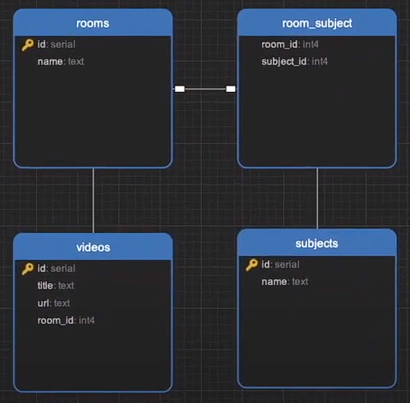

# api-rest-typescript
 
Simple project testing API with typeORM (postgreSQL)

### Entities:
- Room
- Video
- Subject

### Relationships:
- Room has one or many videos (One-To-Many)
- Room has one or many subjects and vice-versa (Many-to-Many)



---

## How to run: 

- Install dependencies

```
yarn
```

- Generate and run migrations

```
yarn migration:generate
yarn migration:run
```

- Start Express server

```
yarn dev
```
